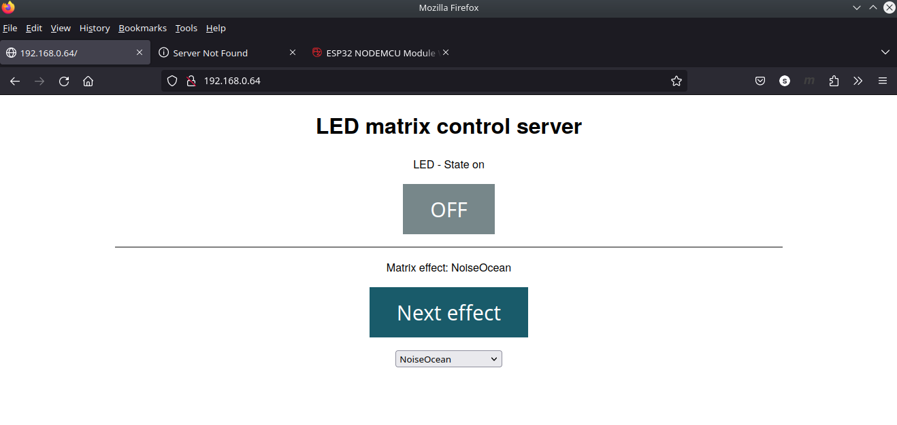

# ledmatrix_platformio

## Summary

- Different routines running on [ESP32 module](https://www.az-delivery.de/en/products/esp32-developmentboard) with connected to it [RTC module](https://www.az-delivery.de/en/products/ds3231-real-time-clock) for controlling of [16x16 LED matrix](https://www.az-delivery.de/en/products/rgb-led-panel-ws2812b-16x16-256-leds-flexibel-led-modul-5050smd-ic-einzeladressierbare-vollfarbfunktionen-mit-dc5v-kompatibel-mit-raspberry-pi). The LED routines found somewhere in Internet

- Written using PlatformIo plugin for vscode
- Switch of routines:
  - automatic to random selected each minute
  - to next using button
  - free selection via simple web interface:

## HW connection

| Periphery  | Pin on ESP module | In Software     |
| ---------- | ----------------- | --------------- |
| Button     | GPIO23            | BUTTON_GPIO     |
| Simple LED | GPIO2             | LED_GPIO        |
| LED matrix | GPIO27            | LED_MATRIX_GPIO |
| RTC SCL    | GPIO22            |                 |
| RTC SDA    | GPIO21            |                 |
